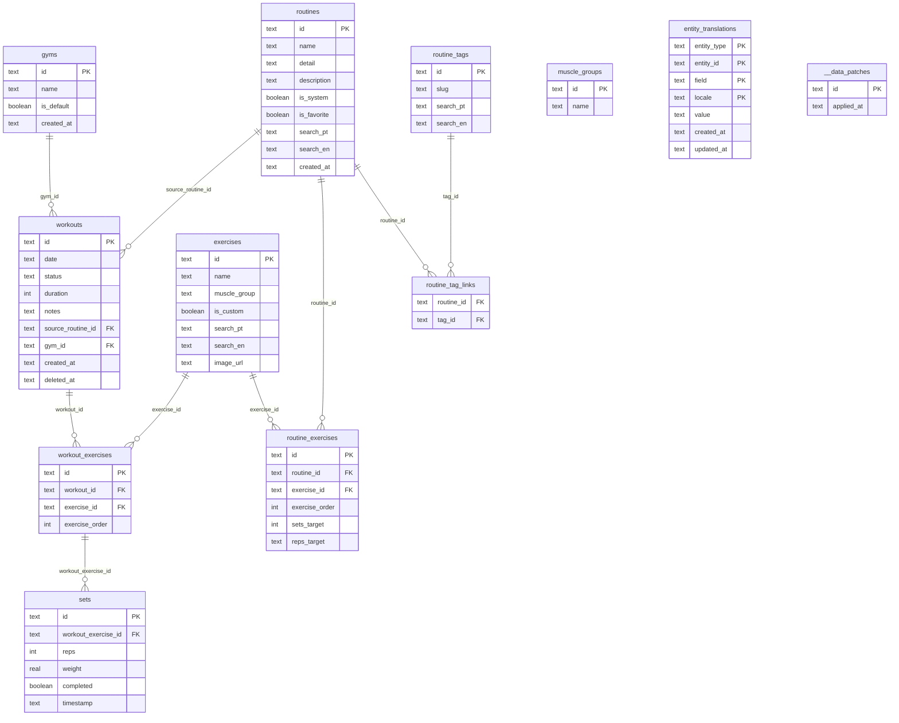

# Database Schema (Drizzle)

This document is the single source of truth for the current relational model used by the app.

## Tables

### Core workout flow

- gyms
- workouts
- workout_exercises
- sets

### Exercise catalog

- muscle_groups
- exercises

### Routine domain

- routines
- routine_exercises
- routine_tags
- routine_tag_links

### Localization

- entity_translations

### Internal control

- \_\_data_patches

## ER Diagram

## Notes

- `routine_tag_links` has composite PK: (`routine_id`, `tag_id`).
- `entity_translations` has composite PK: (`entity_type`, `entity_id`, `field`, `locale`).
- `workouts.source_routine_id` is nullable: workout can be free (no routine) or associated to one routine.
- Legacy compatibility: existing rows can still be resolved from `workouts.notes.sourceRoutineId` while data is backfilled.
- User-facing localized labels come from `entity_translations`; base columns are fallback values.
