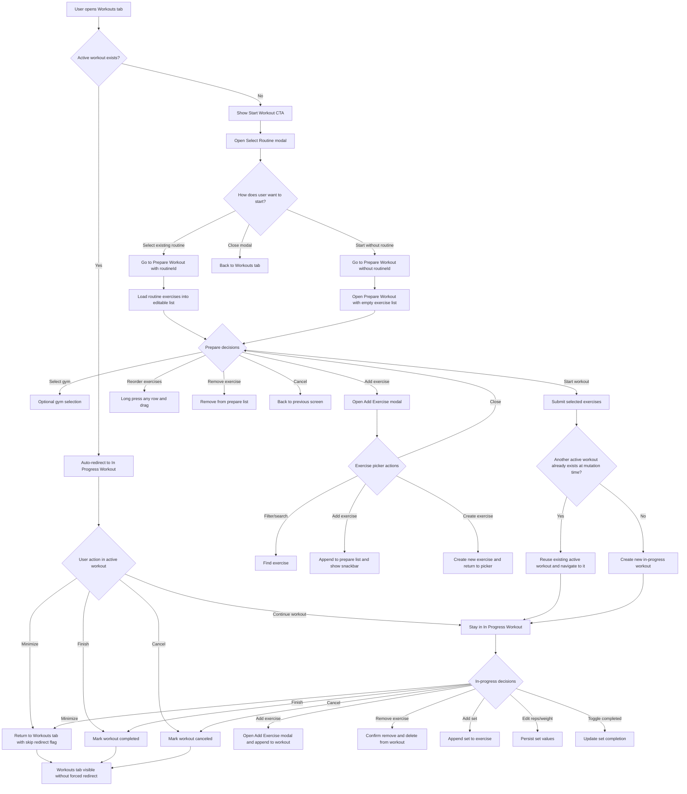

# Start Workout E2E Flow

This document describes the current end-to-end flow for `Start Workout`, including the implemented decision points, fallback behavior, and user paths.

## Scope

This flow starts from the `Workouts` tab and covers:

- Active workout detection
- Start workout entry
- Start with an existing routine
- Start without a routine
- Prepare workout decisions
- In-progress workout decisions
- Finish or cancel workout

It reflects the current implemented app behavior.

## Mermaid Flow

## Decision Rules

### 1. Workouts tab entry

- When the user opens the `Workouts` tab, the app checks for an active workout.
- If an active workout exists and there is no skip flag, the app immediately redirects to `In Progress Workout`.
- If the user minimized the workout earlier, the app sets a skip flag so the tab can be shown without redirecting again.

### 2. Start Workout modal

- If there is no active workout, the user can open the `Start Workout` modal.
- The modal currently supports:
  - selecting an existing routine
  - starting without a routine
  - closing the modal without changes

### 3. Starting with a routine

- The user selects a routine.
- The app navigates to `Prepare Workout` with `routineId`.
- Routine exercises are loaded into an editable list.

### 4. Starting without a routine

- The user chooses `Start without routine`.
- The app navigates to `Prepare Workout` without `routineId`.
- The exercise list starts empty.

### 5. Prepare Workout behavior

- Gym is optional.
- The user can:
  - add exercises
  - reorder exercises
  - remove exercises
  - cancel preparation
  - start workout
- The add-exercise picker supports:
  - search
  - single muscle-group filter
  - image preview
  - create exercise
  - inline feedback via snackbar after add

### 6. Starting the workout from Prepare

- On submit, the app builds the exercise payload from the editable list.
- If another active workout exists at mutation time, the mutation reuses that workout instead of creating a second active session.
- Otherwise, a new in-progress workout is created.

### 7. In Progress Workout behavior

- The user can:
  - add exercises during the workout
  - remove exercises during the workout
  - add sets
  - edit reps and weight
  - toggle set completion
  - minimize the workout
  - finish the workout
  - cancel the workout

### 8. Removing exercises

- In `Prepare Workout`, removing an exercise updates the local editable list and normalizes order.
- In `In Progress Workout`, removing an exercise:
  - asks for confirmation
  - deletes the workout exercise from the database
  - removes related sets through cascade delete
  - normalizes remaining `exerciseOrder`

### 9. Finish vs Cancel

- `Finish Workout` marks the workout as completed and calculates duration.
- `Cancel Workout` marks the workout as canceled.
- Both paths return the user to the Workouts area.

## Current UX Intent

The current flow is optimized for fast workout start:

- no routine is required
- exercises can be added before or during the workout
- the user is not blocked by missing structure up front
- accidental additions/removals are recoverable through inline controls and confirmations

## Notes

- The current flow does not require routine creation before starting a workout.
- The post-workout flow for saving a completed workout as a routine is not included here.
- This document is intended to describe the implemented behavior, not future ideas.
